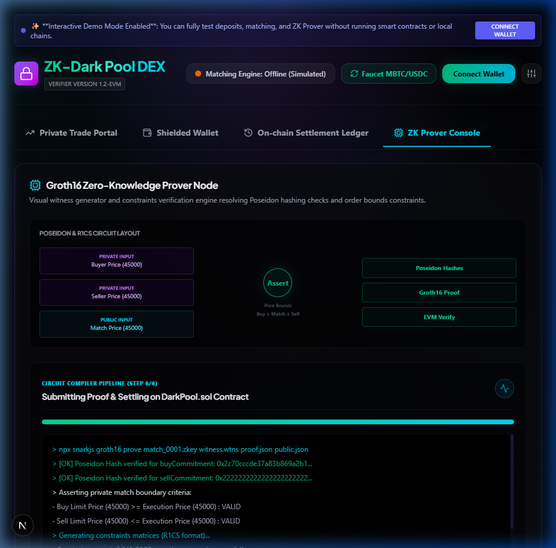

# ZK-Dark Pool DEX

A portfolio-grade, decentralized **Dark Pool Exchange** that enables privacy-preserving token trading using Zero-Knowledge Proofs (ZKPs). Users can deposit assets, submit cryptographically masked order commitments, match orders off-chain via a high-concurrency matching engine, generate ZK proofs validating the match details without exposing private parameters, and settle trades on-chain.

## Design Preview



---

## Technical Stack & Architecture

```mermaid
flowchart TD
    classDef client fill:#10b981,stroke:#047857,color:#fff,stroke-width:2px;
    classDef engine fill:#06b6d4,stroke:#0891b2,color:#fff,stroke-width:2px;
    classDef zk fill:#8b5cf6,stroke:#6d28d9,color:#fff,stroke-width:2px;
    classDef chain fill:#f59e0b,stroke:#d97706,color:#fff,stroke-width:2px;

    subgraph Client ["Next.js Frontend Client (dApp)"]
        A["Injected Wallet (Wagmi/Viem)"]
        B["Shielded Balances Manager"]
        C["Poseidon Hash Generator"]
    end

    subgraph Matchmaker ["Go Matching Engine (Backend)"]
        F["Order Book Manager (WebSocket Hub)"]
        G["Matcher Engine (Price/Time Priority)"]
    end

    subgraph Prover ["Local Prover Node"]
        H["Circom Circuit (match.circom)"]
        I["SnarkJS Prover (Groth16 WebAssembly)"]
    end

    subgraph Ledger ["Hardhat Local Network (Blockchain)"]
        E["DarkPool.sol (Shielded Registry)"]
        J["Verifier.sol (Groth16 Verifier)"]
    end

    %% Flow arrows
    A -->|1. Approve & Deposit Assets| E
    E -->|2. Mint Shielded Balance| B
    B -->|3. Construct Private Order| C
    C -->|4. Register Poseidon Commitments| E
    C -->|5. Relay Plaintext Order Details (WS)| F
    F -->|6. Queue in Sort Book| G
    G -->|7. Broadcast Match Event (WS)| B
    B -->|8. Generate Witness & Constraints| H
    H -->|9. Compute Groth16 Snark Proof| I
    I -->|10. Submit Proof & Public Match Parameters| E
    E -->|11. Execute Verification Call| J
    J -->|12. Valid Proof confirmation| E
    E -->|13. Atomically Update Shielded Balances| E

    class A,B,C client;
    class F,G engine;
    class H,I zk;
    class E,J chain;
```

### Components
1.  **Smart Contracts & ZK Circuits (`/contracts`)**:
    *   **Circom Circuits**: A zero-knowledge circuit (`match.circom`) verifying that a buyer's limit price is $\ge$ execution match price, seller's limit price is $\le$ execution match price, and matched amount respects both limit volumes, using Poseidon hashing for private inputs.
    *   **Solidity Ledger**: `DarkPool.sol` tracks internal shielded balances, acts as an order commitment registry, calls the autogenerated Groth16 `Verifier.sol` to validate match proofs, and settles trades.
2.  **Go Matching Engine (`/backend`)**:
    *   A high-performance concurrent order book written in Go.
    *   Exposes a WebSocket Hub (`server.go`) to listen to order details, maintain sorting orders, check crossed prices, and broadcast matches to client subscribers.
3.  **Next.js Web3 Dashboard (`/frontend`)**:
    *   A modern, premium, dark-mode dashboard built with **Next.js 15, TailwindCSS v4, Wagmi, and Viem**.
    *   Allows users to interact with a faucet, shield assets (deposit), submit order hashes, view active commitments, and run a step-by-step visualizer of witness generation, proving, and contract settlement.

---

## Getting Started

Follow these steps to run all three projects locally.

### Prerequisites
*   [Node.js (v18+)](https://nodejs.org/) & `npm`
*   [Go (v1.21+)](https://go.dev/doc/install) *(required to run the off-chain matching engine)*
*   A Web3 Wallet browser extension (e.g., [MetaMask](https://metamask.io/))

---

### Step 1: Deploy Smart Contracts

1.  Navigate into the `contracts` directory and install dependencies:
    ```bash
    cd contracts
    npm install
    ```
2.  Start the local Hardhat blockchain node:
    ```bash
    npx hardhat node
    ```
    *Keep this terminal window open.*
3.  In a new terminal window, deploy the contracts to the local network:
    ```bash
    npm run deploy:local
    ```
    This compiles the contracts, deploys the `Verifier`, `DarkPool`, and mock token contracts (`MBTC` and `MUSDC`), and mints initial tokens to testing accounts. **Note the contract addresses printed in the console.**

---

### Step 2: Start the Go Matching Engine

1.  Navigate to the `backend` directory:
    ```bash
    cd ../backend
    ```
2.  Synchronize the dependencies and run the server:
    ```bash
    go mod tidy
    go run main.go
    ```
    The engine will start on `http://localhost:8080` and listen for WebSocket requests on `/ws`.

---

### Step 3: Run the Next.js Frontend

1.  Navigate to the `frontend` directory:
    ```bash
    cd ../frontend
    ```
2.  Install dependencies:
    ```bash
    npm install
    ```
3.  Run the development server:
    ```bash
    npm run dev
    ```
4.  Open [http://localhost:3000](http://localhost:3000) in your web browser.

---

## Running a Test Trade Flow

To verify that the integration is fully functional:

1.  **Configure Your Wallet**:
    *   Open MetaMask and connect to your local network (`Localhost 8545` or RPC `http://127.0.0.1:8545` with Chain ID `31337`).
    *   Import one of the default Hardhat accounts using its private key (printed in your Hardhat node terminal console) to access mock native ETH.
2.  **Claim Faucet Tokens**:
    *   On the frontend, click the **Faucet** button to claim `100 MBTC` and `100,000 MUSDC` directly into your connected wallet.
3.  **Shield Tokens**:
    *   Go to the **Shielded Wallet** tab.
    *   Deposit `10 MBTC` and `50,000 MUSDC` to shield them. This approves the tokens and deposits them into `DarkPool.sol`.
4.  **Submit a Buy Order**:
    *   Go to the **Private Trade** tab.
    *   Select **BUY MBTC**, set the price to `45000` MUSDC and amount to `1` MBTC.
    *   Click **Submit Order Commitment**. This hashes the order parameters, submits the hash to the contract, and relays the order details to the Go backend.
5.  **Submit a Match**:
    *   Submit a matching **SELL MBTC** order for `1` MBTC at `45000` MUSDC.
    *   The Go engine matches the overlapping orders and broadcasts the match.
6.  **ZK Verification & Settlement**:
    *   The UI automatically opens the **ZK Prover** tab, showing an animated step-by-step visualizer of the witness constraint checks and Groth16 proof generation.
    *   Once finalized, the settlement transaction is submitted on-chain and your internal shielded balances are updated!

---

## Verifying Contracts & Testing

To run automated unit tests for the smart contracts:
```bash
cd contracts
npm run test
```
The test suite validates deposit tracking, commitment protection, and correct balance updates during ZK settlements.
